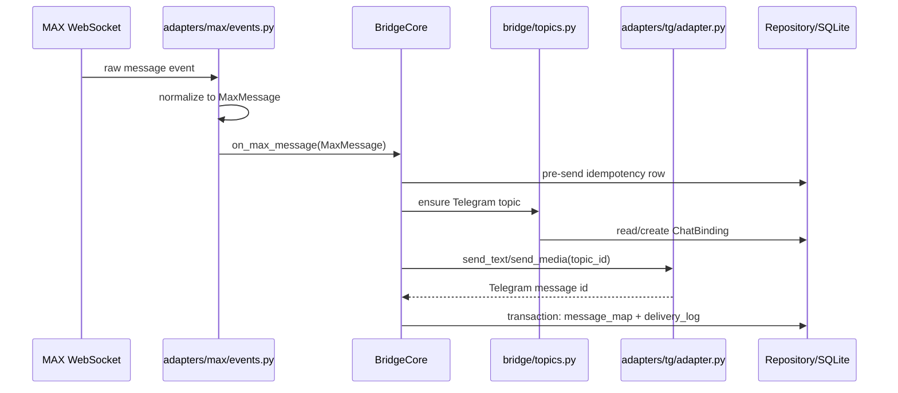
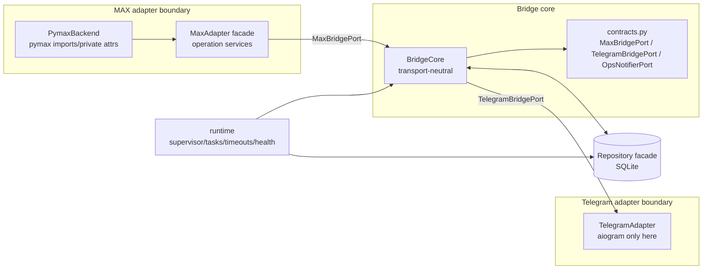

# Обзор архитектуры

**[English version →](architecture-tour.md)**

Короткий walkthrough для ревьюера: что делает Maxgram, где границы системы и почему backend MAX можно заменить без переписывания bridge core.

## Зачем это нужно

MAX используется как обязательный мессенджер в школах и публичных организациях, но у него нет официального Telegram-клиента и открытого API. Maxgram запускает личный MAX userbot, зеркалит каждый MAX чат в отдельный Telegram forum topic и отправляет ответы из Telegram обратно в MAX. Главная сложность не в "переслать текст", а в 24/7 устойчивости на одном аккаунте, undocumented API и privacy-инварианте: успешные тексты/медиа не сохраняются.

## Путь сообщения



Обратный путь симметричен: `TelegramAdapter` принимает ответ в топике, `BridgeCore` разрешает `ChatBinding` и, если он есть, mapping `reply_to`, после чего `MaxAdapter.send_message()` отправляет через текущий MAX backend.

## Границы компонентов



`BridgeCore` не импортирует `pymax`, `aiogram` или concrete adapters. Runtime wiring живет в `src/startup/composition.py`, поэтому замена MAX backend сводится к новому пакету под `src/adapters/max/backends/` и client-port adapter.

## Доказательство заменяемости

Заменяемость проверяется в CI, а не только описана в ADR. `tests/integration/test_bridge_end_to_end.py` запускает полный bridge против `tests/fakes/fake_max_backend.py`: fake MAX message попадает в Telegram topic, а Telegram reply возвращается в captured fake MAX send. Мини-демо без credential'ов:

```bash
python examples/swap_max_backend.py
```

Это доказывает важную границу: `BridgeCore` зависит от `MaxBridgePort`/DTO, а не от PyMax object shape.

## Компенсация хрупкости

| Класс / helper | Файл | Что решает | Regression guard |
|---|---|---|---|
| `BridgeSessionStore` | `src/adapters/max/backends/pymax/session_store.py` | Разовый импорт legacy-таблицы сессий PyMax v1 в схему PyMax v2 | `tests/test_max_adapter_leaves.py`, `tests/test_pymax_surface_pin.py` |
| `BridgeConnectionManager` | `src/adapters/max/backends/pymax/transport.py` | Собственное egress-соединение bridge с 16-битной семантикой TCP sequence из PyMax 2.1 | sequence guard and `pymax_tcp_sequence_overflow` legacy marker tests |
| `BridgeMsgpackPayloadCodec` | `src/adapters/max/backends/pymax/transport.py` | MAX-мапы msgpack с ключами-массивами, которые строгий msgpack отвергает | msgpack codec regression in `tests/test_max_adapter_leaves.py` |
| `BridgeAuthService` + `validate_login_response` | `src/adapters/max/backends/pymax/login.py` | Убирает неизвестные upstream-варианты и чинит некритичный дрейф initial-sync payload до валидации | login payload and validation-drift tests in `tests/test_max_adapter_leaves.py` |
| `BridgeClient` + `PymaxClientAdapter.start()` | `src/adapters/max/backends/pymax/transport.py`, `client_adapter.py` | Ставит локальные сервисы и TCP-guard после ленивого создания runtime в PyMax 2.4.1; использует one-shot connect, оставляя reconnect за bridge | lazy-runtime, one-shot connect, and PyMax surface-pin regressions |
| `EgressTCPTransport` | `src/adapters/max/backends/pymax/transport.py` | Подставляет authenticated HTTP CONNECT proxy для RU-egress только MAX-трафика | `tests/test_max_egress.py` and pymax egress transport test |
| `PymaxInternalsContractError` | `src/adapters/max/backends/pymax/internals.py` | Централизует доступ к приватным атрибутам PyMax и падает явно при upstream drift | internals contract tests plus `test_pymax_surface_pin.py` |

## Безопасность рантайма

- `BridgeSupervisor.run(stop_event=...)` держит PID1 живым, перезапускает упавший worker с exponential backoff и jitter, а намеренные SIGTERM/SIGINT трактует как graceful shutdown.
- Detached-задачи создаются через `create_logged_task(...)`: traceback от fire-and-forget задач не теряется в логах.
- Внешние await к MAX/TG/CDN обёрнуты в `with_timeout(...)`. Таймаут превращается в типизированный `BridgeExternalTimeout`, поэтому существующие retry/failure пути обрабатывают его как временный сбой.
- Health state пишется атомарной перезаписью файлов; textfile-метрики по умолчанию идут в `data/maxtg_bridge.prom` и позже могут быть подхвачены node_exporter textfile collector.
- Внешний watchdog на втором VPS наблюдает за всем этим снаружи — см. [runbook](runbooks/watchdog.md).

## Правила хранения

SQLite хранит routing- и delivery-метаданные, а не содержимое доставленных сообщений. Исключения — временные durable retry-очереди для недоставленных текстов (до доставки или TTL) и зашифрованные TTL-подсказки по медиа в `media_recovery_cache` для проблемных MAX-вложений.

`Repository.transaction()` предназначена только для сгруппированных записей после отправки. Не держи транзакцию вокруг сетевых await к Telegram/MAX: сначала отправка, затем атомарная запись mapping/delivery/queue.

## Что читать дальше

- [Полная архитектура](architecture.md)
- [ADR-006: Bridge contracts boundary](decisions/ADR-006-bridge-contracts-boundary.md)
- [ADR-007: MAX backend boundary](decisions/ADR-007-max-backend-boundary.md)
- [ADR-010: PyMax v2 migration](decisions/ADR-010-pymax-v2-migration.md)
- [ADR-011: Encrypted TTL media recovery cache](decisions/ADR-011-media-recovery-cache.md)
- [Операционный runbook](runbooks/operations.md)
- [Watchdog: внутренний и внешний](runbooks/watchdog.md)
- [Production deploy runbook](runbooks/hetzner-production.md)
- [Аудит архитектуры](archive/audit-2026-05-25.md)
