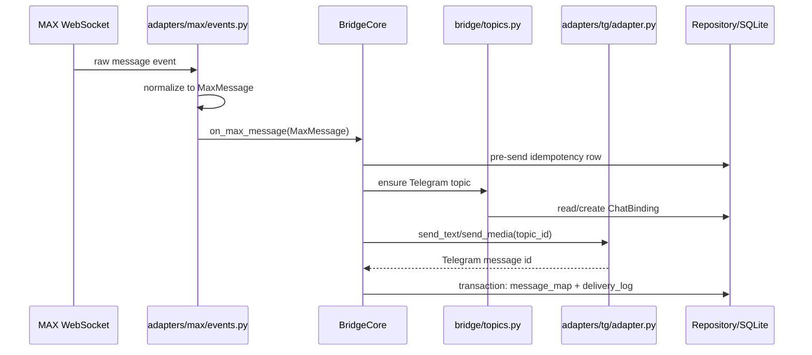
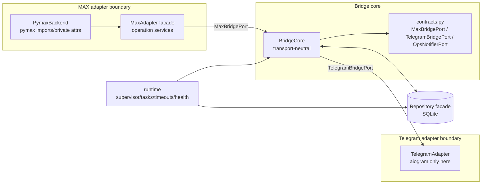

# Architecture Tour

Короткий walkthrough для ревьюера: что делает Maxgram, где границы системы и почему backend MAX можно заменить без переписывания bridge core.

## Why This Exists

MAX используется как обязательный мессенджер в школах и публичных организациях, но у него нет официального Telegram-клиента и открытого API. Maxgram запускает личный MAX userbot, зеркалит каждый MAX чат в отдельный Telegram forum topic и отправляет ответы из Telegram обратно в MAX. Главная сложность не в "переслать текст", а в 24/7 устойчивости на одном аккаунте, undocumented API и privacy-инварианте: успешные тексты/медиа не сохраняются.

## Message Flow



Reply path is symmetric: `TelegramAdapter` receives a topic reply, `BridgeCore` resolves the `ChatBinding` and optional `reply_to` mapping, then `MaxAdapter.send_message()` sends through the current MAX backend.

## Component Boundary



`BridgeCore` не импортирует `pymax`, `aiogram` или concrete adapters. Runtime wiring живет в `src/startup/composition.py`, поэтому замена MAX backend сводится к новому пакету под `src/adapters/max/backends/` и client-port adapter.

## Replaceability Proof

Заменяемость проверяется в CI, а не только описана в ADR. `tests/integration/test_bridge_end_to_end.py` запускает полный bridge против `tests/fakes/fake_max_backend.py`: fake MAX message попадает в Telegram topic, а Telegram reply возвращается в captured fake MAX send. Мини-демо без credential'ов:

```bash
python examples/swap_max_backend.py
```

Это доказывает важную границу: `BridgeCore` зависит от `MaxBridgePort`/DTO, а не от PyMax object shape.

## Fragility Mitigation

| Класс / helper | Файл | Что решает | Regression guard |
|---|---|---|---|
| `BridgeSessionStore` | `src/adapters/max/backends/pymax/session_store.py` | One-shot import legacy PyMax v1 session table into PyMax v2 schema | `tests/test_max_adapter_leaves.py`, `tests/test_pymax_surface_pin.py` |
| `BridgeConnectionManager` | `src/adapters/max/backends/pymax/transport.py` | Bridge-owned egress connection with PyMax 2.1 16-bit TCP sequence semantics | sequence guard and `pymax_tcp_sequence_overflow` legacy marker tests |
| `BridgeMsgpackPayloadCodec` | `src/adapters/max/backends/pymax/transport.py` | MAX msgpack maps with array-valued keys that strict msgpack rejects | msgpack codec regression in `tests/test_max_adapter_leaves.py` |
| `BridgeAuthService` + `sanitize_login_payload` | `src/adapters/max/backends/pymax/login.py` | Strip upstream-unknown `UNSUPPORTED` attachment variants before validation | login payload tests in `tests/test_max_adapter_leaves.py` |
| `EgressTCPTransport` | `src/adapters/max/backends/pymax/transport.py` | Inject authenticated HTTP CONNECT proxy for MAX-only RU egress | `tests/test_max_egress.py` and pymax egress transport test |
| `PymaxInternalsContractError` | `src/adapters/max/backends/pymax/internals.py` | Centralize private PyMax attr access and fail loudly on upstream drift | internals contract tests plus `test_pymax_surface_pin.py` |

## Runtime Safety

- `BridgeSupervisor.run(stop_event=...)` keeps PID1 alive, restarts worker crashes with exponential backoff + jitter, and treats intentional SIGTERM/SIGINT as graceful shutdown.
- Detached work uses `create_logged_task(...)`; failures from fire-and-forget tasks keep traceback in logs.
- External MAX/TG/CDN awaits use `with_timeout(...)`. Timeout becomes typed `BridgeExternalTimeout`, so existing retry/failure paths handle it as transient.
- Health state is persisted through atomic rewrite files; textfile metrics default to `data/maxtg_bridge.prom` and can be pointed at node_exporter textfile collector later.

## Persistence Rules

SQLite stores routing and delivery metadata, not successful message content. The exception is temporary durable retry queues for undelivered text-only messages until delivery/TTL.

`Repository.transaction()` is for grouped post-send writes only. Do not hold a transaction around Telegram/MAX network awaits: send first, then atomically persist mapping/delivery/queue rows.

## Where To Read Next

- [Full architecture](architecture.md)
- [ADR-006: Bridge contracts boundary](decisions/ADR-006-bridge-contracts-boundary.md)
- [ADR-007: MAX backend boundary](decisions/ADR-007-max-backend-boundary.md)
- [ADR-010: PyMax v2 migration](decisions/ADR-010-pymax-v2-migration.md)
- [Operations runbook](runbooks/operations.md)
- [Production deploy runbook](runbooks/hetzner-production.md)
- [Architecture audit](archive/audit-2026-05-25.md)
