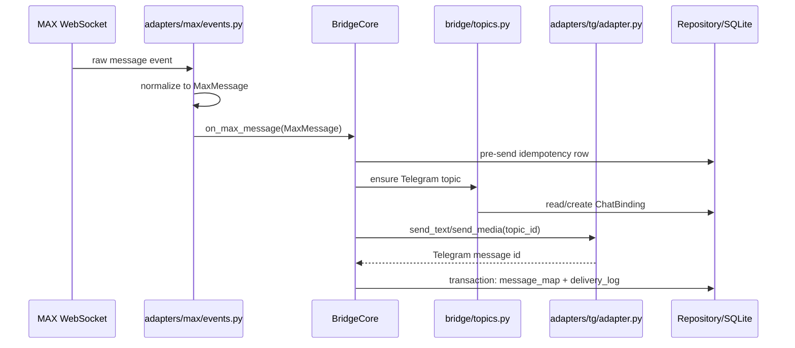
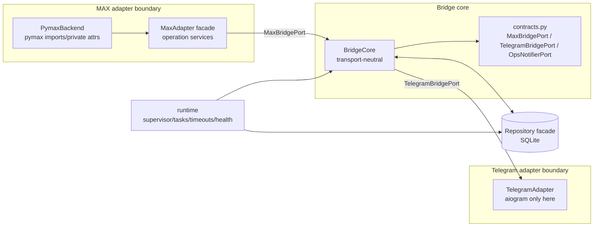

# Architecture Tour

**[Русская версия / Russian version →](architecture-tour-ru.md)**

A short walkthrough for reviewers: what Maxgram does, where the system
boundaries are, and why the MAX backend can be replaced without rewriting the
bridge core.

## Why This Exists

MAX is a mandatory messenger in Russian schools and public institutions, but it
has no official Telegram client and no open API. Maxgram runs a personal MAX
userbot, mirrors every MAX chat into its own Telegram forum topic, and routes
replies from Telegram back into MAX. The hard part is not "forward the text" —
it is staying up 24/7 on a single account against an undocumented API, while
holding a privacy invariant: delivered text and media are never stored.

## Message Flow


```mermaid
sequenceDiagram
    participant MAX as MAX WebSocket
    participant Events as adapters/max/events.py
    participant Core as BridgeCore
    participant Topics as bridge/topics.py
    participant TG as adapters/tg/adapter.py
    participant DB as Repository/SQLite

    MAX->>Events: raw message event
    Events->>Events: normalize to MaxMessage
    Events->>Core: on_max_message(MaxMessage)
    Core->>DB: pre-send idempotency row
    Core->>Topics: ensure Telegram topic
    Topics->>DB: read/create ChatBinding
    Core->>TG: send_text/send_media(topic_id)
    TG-->>Core: Telegram message id
    Core->>DB: transaction: message_map + delivery_log
```

The reply path is symmetric: `TelegramAdapter` receives a topic reply,
`BridgeCore` resolves the `ChatBinding` and an optional `reply_to` mapping, then
`MaxAdapter.send_message()` sends through the current MAX backend.

## Component Boundary


```mermaid
flowchart LR
    subgraph maxBox["MAX adapter boundary"]
        Pymax["PymaxBackend<br/>pymax imports/private attrs"]
        MaxAdapter["MaxAdapter facade<br/>operation services"]
        Pymax --> MaxAdapter
    end

    subgraph coreBox["Bridge core"]
        Core["BridgeCore<br/>transport-neutral"]
        Contracts["contracts.py<br/>MaxBridgePort / TelegramBridgePort / OpsNotifierPort"]
        Core --> Contracts
    end

    subgraph tgBox["Telegram adapter boundary"]
        TgAdapter["TelegramAdapter<br/>aiogram only here"]
    end

    DB[("Repository facade<br/>SQLite")]
    Runtime["runtime<br/>supervisor/tasks/timeouts/health"]

    MaxAdapter -- "MaxBridgePort" --> Core
    Core -- "TelegramBridgePort" --> TgAdapter
    Core <--> DB
    Runtime --> Core
    Runtime --> DB
```

`BridgeCore` imports neither `pymax`, nor `aiogram`, nor any concrete adapter.
Runtime wiring lives in `src/startup/composition.py`, so replacing the MAX
backend comes down to a new package under `src/adapters/max/backends/` plus a
client-port adapter.

## Replaceability Proof

Replaceability is verified in CI, not merely asserted in an ADR.
`tests/integration/test_bridge_end_to_end.py` runs the full bridge against
`tests/fakes/fake_max_backend.py`: a fake MAX message reaches a Telegram topic,
and a Telegram reply comes back as a captured fake MAX send. A credential-free
demo:

```bash
python examples/swap_max_backend.py
```

This proves the boundary that matters: `BridgeCore` depends on `MaxBridgePort`
and DTOs, not on the PyMax object shape.

## Fragility Mitigation

| Class / helper | File | What it solves | Regression guard |
|---|---|---|---|
| `BridgeSessionStore` | `src/adapters/max/backends/pymax/session_store.py` | One-shot import of the legacy PyMax v1 session table into the PyMax v2 schema | `tests/test_max_adapter_leaves.py`, `tests/test_pymax_surface_pin.py` |
| `BridgeConnectionManager` | `src/adapters/max/backends/pymax/transport.py` | Bridge-owned egress connection with PyMax 2.1 16-bit TCP sequence semantics | sequence guard and `pymax_tcp_sequence_overflow` legacy marker tests |
| `BridgeMsgpackPayloadCodec` | `src/adapters/max/backends/pymax/transport.py` | MAX msgpack maps with array-valued keys that strict msgpack rejects | msgpack codec regression in `tests/test_max_adapter_leaves.py` |
| `BridgeAuthService` + `validate_login_response` | `src/adapters/max/backends/pymax/login.py` | Strips upstream-unknown variants and repairs non-critical initial-sync payload drift before validation | login payload and validation-drift tests in `tests/test_max_adapter_leaves.py` |
| `BridgeClient` + `PymaxClientAdapter.start()` | `src/adapters/max/backends/pymax/transport.py`, `client_adapter.py` | Installs local services and TCP guards after PyMax 2.4.1 creates its lazy runtime; uses one-shot connect and leaves reconnect to the bridge | lazy-runtime, one-shot connect, and PyMax surface-pin regressions |
| `EgressTCPTransport` | `src/adapters/max/backends/pymax/transport.py` | Injects an authenticated HTTP CONNECT proxy for MAX-only RU egress | `tests/test_max_egress.py` and the pymax egress transport test |
| `PymaxInternalsContractError` | `src/adapters/max/backends/pymax/internals.py` | Centralizes private PyMax attribute access and fails loudly on upstream drift | internals contract tests plus `test_pymax_surface_pin.py` |

## Runtime Safety

- `BridgeSupervisor.run(stop_event=...)` keeps PID1 alive, restarts worker
  crashes with exponential backoff + jitter, and treats intentional
  SIGTERM/SIGINT as graceful shutdown.
- Detached work uses `create_logged_task(...)`; failures from fire-and-forget
  tasks keep their traceback in the logs.
- External MAX/TG/CDN awaits use `with_timeout(...)`. A timeout becomes a typed
  `BridgeExternalTimeout`, so existing retry/failure paths handle it as
  transient.
- Health state is persisted through atomic rewrite files; textfile metrics
  default to `data/maxtg_bridge.prom` and can be pointed at a node_exporter
  textfile collector later.
- An external watchdog on a second VPS observes all of the above from outside
  the failure domain — see the [watchdog runbook](runbooks/watchdog.md).

## Persistence Rules

SQLite stores routing and delivery metadata, not delivered message content. The
exceptions are temporary durable retry queues for undelivered text-only messages
(until delivery or TTL) and encrypted TTL media hints in `media_recovery_cache`
for failed or problematic MAX attachments.

`Repository.transaction()` is for grouped post-send writes only. Do not hold a
transaction around Telegram/MAX network awaits: send first, then atomically
persist mapping, delivery and queue rows.

## Where To Read Next

- [Full architecture](architecture.md)
- [ADR-006: Bridge contracts boundary](decisions/ADR-006-bridge-contracts-boundary.md)
- [ADR-007: MAX backend boundary](decisions/ADR-007-max-backend-boundary.md)
- [ADR-010: PyMax v2 migration](decisions/ADR-010-pymax-v2-migration.md)
- [ADR-011: Encrypted TTL media recovery cache](decisions/ADR-011-media-recovery-cache.md)
- [ADR-012: External watchdog](decisions/ADR-012-external-watchdog.md)
- [Operations runbook](runbooks/operations.md)
- [Watchdog: internal and external](runbooks/watchdog.md)
- [Production deploy runbook](runbooks/hetzner-production.md)
- [Architecture audit](archive/audit-2026-05-25.md)
