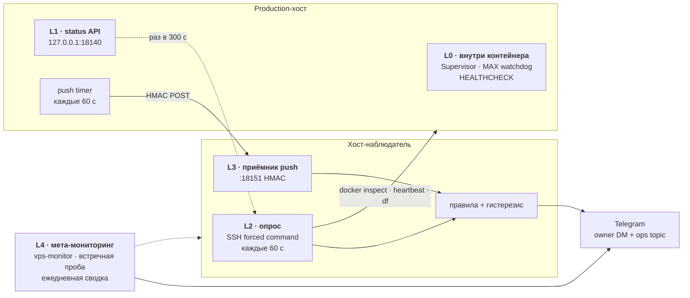

# Watchdog: внутренний и внешний

Единый документ про то, как bridge замечает собственные поломки и кто замечает
поломки, которые bridge заметить не в состоянии.

Читать сверху вниз: сначала модель отказов (что вообще может сломаться), потом
слои наблюдения (кто это ловит), потом таблица «алерт → действие».

- **Наблюдаемый хост:** production-VPS с bridge, контейнер `deploy-bridge-1`
- **Наблюдатель:** второй VPS, контейнер `maxtg-watchdog`
- **Куда приходят алерты:** owner DM + ops topic, тем же ботом, что и остальные
  сообщения bridge, но запрос уходит с наблюдателя напрямую в Telegram Bot API

---

## 1. Модель отказов

### 1.1. Три оси

Каждый отказ раскладывается по трём осям — из них следует, кто способен его увидеть
и что делать после алерта.

| Ось | Значения | Что определяет |
|---|---|---|
| **Уровень** | процесс → контейнер → хост → сеть → внешняя зависимость (MAX / Telegram) → канал доставки алертов | кто физически способен заметить |
| **Самовосстановление** | авто · авто с cooldown · только вручную | алерт информирует или требует действий |
| **Наблюдаемость** | изнутри · только снаружи | нужен ли внешний наблюдатель |

### 1.2. Две аксиомы

Вся конструкция watchdog выводится из двух утверждений:

> **Аксиома 1.** Отказ, ломающий канал алертов, не может быть обнаружен этим же каналом.

Если у bridge сломалась доставка в Telegram, сообщение «у меня сломалась доставка в
Telegram» отправить некому. То же самое с остановленным контейнером и упавшим хостом:
там просто некому формировать алерт. Отсюда — независимый наблюдатель на другом
хосте, со своим сетевым путём до `api.telegram.org`.

> **Аксиома 2.** Наблюдатель обязан отличать смерть объекта от смерти пути наблюдения.

Если наблюдатель перестал получать ответы, это ещё не значит, что объект мёртв —
мог отвалиться канал опроса. Отсюда — второй, встречный канал (push) и отдельная
проба доступности хоста.

### 1.3. Каталог классов отказов

Три строки в колонке «кто ловил раньше» до этой работы были заполнены словом
**никто** — ради них всё и делалось.

| # | Класс | Симптом | Кто ловил раньше | Кто ловит сейчас | Латентность | Восстановление |
|---|---|---|---|---|---|---|
| **F1** | Падение worker | исключение убивает задачу, код `worker_crashed` | Supervisor | Supervisor + `restart_storm` снаружи | секунды | авто, backoff до 300 с |
| **F2** | Зависание worker | процесс жив, heartbeat не обновляется | `HEALTHCHECK` ставит `unhealthy` — и всё | `heartbeat_stale`, `container_unhealthy` | ~3 мин | **вручную** |
| **F3** | MAX link мёртв, egress жив | `is_ready()` false, `link_offline` | MAX watchdog → `os._exit(75)` | он же + `restart_storm` при зацикливании | 180 с + cooldown | авто с cooldown 1800 с |
| **F4** | MAX egress лёг (Channel M) | `max_egress_unavailable` | bridge алертит своим каналом | `subsystem_issue` (crit) | ~1 мин | **вручную** — рестарт не помогает |
| **F5** | MAX token инвалидирован | `requires_reauth=true` | bridge алертит | `subsystem_issue` с отдельной формулировкой | ~1 мин | **только вручную**, `scripts/max_reauth.py` |
| **F6** | **Сломан сам канал алертов** | `system_notification_failed`, растёт `alert_outbox.jsonl` | **никто** | `alert_outbox_backlog` — через независимый путь наблюдателя | ~10 мин | по причине |
| **F7** | Отказ SQLite | `storage_unavailable` | Supervisor, возможен цикл | + `restart_storm`, `subsystem_issue` | сек–мин | авто или вручную |
| **F8** | **Контейнер остановлен** | `docker compose stop/down`, сорвавшийся деплой | **никто** — `restart: always` на явный stop не действует | `container_down` (crit) | ~60–120 с | **только вручную** |
| **F9** | **Хост / VM / Docker daemon лёг** | не отвечает ничего | **никто** | `host_unreachable` + `push_stale` | ~60–120 с | авто или вручную |
| **F10** | Кончается диск | падают записи в SQLite, логи, health-файлы | никто, проявится как F2/F7 | `disk_low` — **опережающий** сигнал | до отказа | вручную |
| **F11** | Restart storm | бесконечный цикл перезапусков | Supervisor алертит на переходах | `restart_storm` по Δ `RestartCount` | ~2 мин | вручную |
| **F12** | Сеть оператор ↔ хост | «у меня не открывается» | никто | наблюдатель подтверждает снаружи, жив ли bridge | сразу | вручную |
| **F13** | Сломан путь наблюдения, bridge жив | firewall drift, fail2ban, sshd | — | `ssh_probe_failed` с отдельной формулировкой | ~2 мин | вручную |
| **F14** | **Умер сам наблюдатель** | контейнер снят, второй VPS лёг | — | `vps-monitor` на его хосте + встречная проба + ежедневная сводка | ≤5 мин / 1 сутки | вручную |
| **F15** | Тихий регресс конфига | `max.egress.active` уехал в `hetzner_direct` | видно только глазами в `/status` | `egress_mode_unexpected` | ~5 мин | вручную |
| **F16** | Копятся очереди | pending-очереди и media-retry растут | только метрики | `queue_backlog` | ~30 мин | вручную |

---

## 2. Слои наблюдения



### L0 — внутри контейнера

**Где:** PID 1 и фоновые задачи внутри `deploy-bridge-1`.

| Механизм | Что делает |
|---|---|
| `BridgeSupervisor` ([supervisor.py](../../src/runtime/supervisor.py)) | перезапускает упавший worker, экспоненциальный backoff до 300 с |
| MAX watchdog ([background.py](../../src/bridge/background.py)) | при живом egress и мёртвом MAX делает `os._exit(75)`, Docker поднимает контейнер; cooldown 1800 с |
| Docker `HEALTHCHECK` | помечает контейнер `unhealthy` по протухшему heartbeat |

**Ловит:** F1, F3, частично F7.
**Не ловит принципиально:** всё, что убивает сам контейнер или его способность
отправлять сообщения — F2 (флаг ставится, но рестарта нет), F6, F8, F9.

### L1 — status API самого bridge

**Где:** `127.0.0.1:18140` внутри контейнера, опубликован на loopback хоста.
Публичного bind-а у bridge по-прежнему нет — наружу API уходит только через
SSH-канал L2.

| Эндпоинт | Аутентификация | Ответ |
|---|---|---|
| `GET /healthz` | нет | `200` / `503` по свежести heartbeat |
| `GET /status` | `Authorization: Bearer <BRIDGE_STATUS_TOKEN>` | JSON: `overall_status`, подсистемы с кодами issue, очереди, `alert_outbox_size`, активный egress |

**Privacy.** В payload попадают только коды и счётчики. Текстов сообщений,
названий чатов, телефонов, invite-ссылок там нет; `raw_cause` исключений
намеренно вырезан — регрессия закреплена тестом
`test_status_payload_never_carries_raw_cause`.

**Ловит:** F4, F5, F6, F15, F16 — состояния, которые bridge про себя знает,
но раньше наружу структурно не отдавал.

### L2 — опрос с хоста-наблюдателя

**Где:** контейнер `maxtg-watchdog` на втором VPS, цикл 60 с.

За цикл выполняются два независимых действия:

1. **TCP-проба** порта SSH — «хост вообще жив?»;
2. **SSH с forced command** — один merged JSON: состояние контейнера
   (`state`, `health`, `RestartCount`), возраст heartbeat, свободное место,
   и раз в 300 с — ответ status API.

Ключ наблюдателя привязан на production-хосте так:

```
command="/usr/local/bin/bridge-status-probe.py",restrict ssh-ed25519 AAAA...
```

`restrict` снимает pty и все форварды, `command=` не даёт выполнить ничего,
кроме read-only пробы. Даже при компрометации наблюдателя этот ключ не даёт
shell на production-хосте.

**Ловит:** F2, F8, F9, F10, F11, F12 — то есть главные дыры.
**Не ловит:** ситуацию, когда сломан сам путь опроса (для этого есть L3).

### L3 — push dead-man's switch

**Где:** таймер `maxtg-watchdog-push.timer` на production-хосте → приёмник
`:18151` внутри контейнера наблюдателя.

Ценность в **направлении**. Когда путь наблюдатель → production ломается, push
продолжает идти, и watchdog говорит не «bridge умер», а «сломан канал опроса».

Push несёт тот же снимок состояния, что и L2, поэтому он работает не только как
сигнал жизни, но и как **резервный источник данных**: при сломанном опросе
правила продолжают считаться по push-снимку, и `ssh_probe_failed` понижается до
🟡 — мы всё ещё видим состояние bridge, просто без резерва. Если push тоже
пропал, наблюдение слепнет, и это уже 🔴.

Payload подписан HMAC-SHA256, защищён окном времени (±300 с) и проверкой на
повтор. TLS не используется осознанно: секретов внутри нет, целостность даёт
подпись, а доступ к порту ограничен одним `/32` на уровне UFW и firewall
провайдера. Пустой `WATCHDOG_PUSH_SECRET` полностью выключает слой.

**Ловит:** F13, плюс второй независимый путь для F9.

### L4 — кто сторожит сторожа

Молчащий наблюдатель неотличим от сломанного, поэтому F14 закрывается
тремя независимыми способами:

| Механизм | Кому принадлежит | Что заметит |
|---|---|---|
| `vps-monitor` на хосте-наблюдателе | vps_management | пропажу контейнера `maxtg-watchdog` (≤5 мин) |
| Встречная проба production → наблюдатель | vps_management | смерть хоста-наблюдателя целиком |
| Ежедневная сводка «внешний watchdog жив» | этот watchdog | тишину в канале (1 сутки) |
| Собственный `HEALTHCHECK` контейнера | этот watchdog | остановившийся цикл проверок |

---

## 3. Правила: от алерта к действию

Сквозная таблица. Пришёл алерт — находим строку, читаем действие.

| Правило | Класс | Срабатывает | Подряд | Severity | Действие |
|---|---|---|---|---|---|
| `host_unreachable` | F9 | нет TCP-ответа на SSH-порт | 2 | 🔴 | консоль провайдера: хост, сеть, firewall |
| `ssh_probe_failed` | F13 | проба не отработала | 2 | 🟡/🔴 | UFW / Cloud Firewall / fail2ban / sshd. При живом push 🟡: данные идут через него. Без push 🔴: наблюдение слепое |
| `container_down` | F8 | контейнера нет или `exited` | 1 | 🔴 | `docker compose --project-name deploy -f deploy/docker-compose.prod.yml up -d bridge` |
| `container_unhealthy` | F2 | docker health `unhealthy` | 3 | 🟡 | смотреть логи; сам по себе не рестартует |
| `heartbeat_stale` | F2 | heartbeat старше 180 с | 2 | 🔴 | ручной перезапуск контейнера |
| `restart_storm` | F11 | ≥3 рестартов за 30 мин | 1 | 🟡 | логи причины падений: самовосстановление не сходится |
| `disk_low` | F10 | свободно <10% | 2 | 🟡 | чистка до того, как посыплются SQLite и health-файлы |
| `status_api_unreachable` | F2/F6 | контейнер жив, `/status` молчит | 2 | 🟡 | `status_api` в `config.local.yaml`, `BRIDGE_STATUS_TOKEN` |
| `overall_degraded` | F1/F7 | не `healthy` дольше 15 мин | 3 | 🟡 | `/status` в Telegram и логи |
| `subsystem_issue` | F3–F5 | активный issue у подсистемы | 2 | 🟡/🔴 | по коду: `max_egress_unavailable` → Channel M; `requires_reauth` → `scripts/max_reauth.py` |
| `alert_outbox_backlog` | F6 | outbox не пуст дольше 10 мин | 2 | 🟡 | **bridge не может докричаться сам** — bot token и сеть |
| `queue_backlog` | F16 | старейшее pending >30 мин | 2 | 🟡 | связность MAX/TG, логи retry-задач |
| `egress_mode_unexpected` | F15 | активен не `home_ru_proxy` | 2 | 🟡 | вернуть штатный egress |
| `push_stale` | F9/F13 | нет push дольше 5 мин | 1 | 🔴 | `maxtg-watchdog-push.timer` и сеть до наблюдателя |

### Как это не превращается в шум

| Приём | Как реализовано |
|---|---|
| **Гистерезис** | алерт уходит после N подряд неудачных проверок; единичный сбой сети не будит |
| **Подавление каскадов** | лёг хост — молчат правила про контейнер, heartbeat и диск: мы про них ничего не знаем, а не «всё сломалось» |
| **Пропуск без данных** | в циклах без опроса API status-правила помечаются «нет данных» и не обнуляют счётчики |
| **Dedup** | повторный тот же алерт не чаще, чем раз в 900 с |
| **Recovery ровно один раз** | восстановление отправляется без dedup и только при реальном переходе |
| **Разделение severity** | 🔴 со звуком, 🟡 и recovery — тихие |

### Как выглядит алерт

```
🔴 [EXT] Контейнер bridge не работает
Наблюдаемый хост: maxtg-bridge-prod (проверка с внешнего VPS)
Класс отказа: F8 · правило container_down

Что сломано: Контейнер deploy-bridge-1: exited, exit code 0.
Что делать: Docker restart: always не действует на явную остановку.
Подними вручную: docker compose --project-name deploy \
  -f deploy/docker-compose.prod.yml up -d bridge
```

Префикс `[EXT]` отличает внешние алерты от внутренних алертов bridge:
если пришёл `[EXT]`, значит сообщение сформировал наблюдатель, и доверять
ему можно даже когда сам bridge молчит.

---

## 4. Пороги

| Параметр | Значение | Env |
|---|---|---|
| Интервал опроса | 60 с | `WATCHDOG_POLL_INTERVAL_SECONDS` |
| Интервал опроса status API | 300 с | `WATCHDOG_STATUS_INTERVAL_SECONDS` |
| Порог протухания heartbeat | 180 с | `WATCHDOG_HEARTBEAT_MAX_AGE_SECONDS` |
| Порог протухания push | 300 с | `WATCHDOG_PUSH_MAX_AGE_SECONDS` |
| Окно приёма push | ±300 с | `WATCHDOG_PUSH_MAX_SKEW_SECONDS` |
| Dedup TTL | 900 с | `WATCHDOG_DEDUP_TTL_SECONDS` |
| Порог свободного места | 10% | `WATCHDOG_DISK_MIN_FREE_PERCENT` |
| Restart storm | 3 за 1800 с | `WATCHDOG_RESTART_STORM_DELTA` |
| Grace для degraded | 900 с | `WATCHDOG_DEGRADED_GRACE_SECONDS` |
| Ожидаемый egress | `home_ru_proxy` | `WATCHDOG_EXPECTED_EGRESS` |
| Ежедневная сводка | час UTC, `-1` = выкл | `WATCHDOG_DAILY_SUMMARY_HOUR_UTC` |

Внутренние пороги bridge (`heartbeat_interval_seconds`, `max_self_heal_grace_seconds`,
`max_self_heal_restart_cooldown_seconds`) живут в секции `health` файла `config.yaml`.

---

## 5. Установка

Три части, каждая ставится отдельно.

### 5.1. Status API на production-хосте

```yaml
# config.local.yaml
status_api:
  enabled: true
  host: "127.0.0.1"
  port: 18140
```

```bash
# .env.secrets на production-хосте
BRIDGE_STATUS_TOKEN=<длинный случайный токен>
```

Без токена API не поднимается вовсе — это осознанно: лучше видимая
неработающая проверка, чем открытый эндпоинт. Дальше обычный deploy.

### 5.2. Агент на production-хосте

```bash
ssh-keygen -t ed25519 -N '' -f ~/.ssh/maxtg_watchdog_key   # выделенная пара
cd infra/ansible
ansible-playbook watchdog-peer.yml \
  -e watchdog_peer_pubkey="$(cat ~/.ssh/maxtg_watchdog_key.pub)"
```

Роль ставит read-only пробу, привязывает к ней ключ и поднимает push-таймер.
Bridge при этом не перезапускается.

### 5.3. Наблюдатель на втором VPS

```bash
cp deploy/external-watchdog/watchdog.env.example deploy/external-watchdog/.env.secrets
$EDITOR deploy/external-watchdog/.env.secrets
mkdir -p deploy/external-watchdog/secrets
cp ~/.ssh/maxtg_watchdog_key deploy/external-watchdog/secrets/watchdog_key

WATCHDOG_DEPLOY_HOST=deploy@<observer_ip> ./deploy/external-watchdog/deploy.sh
```

### 5.4. Ручные шаги, которые не автоматизируются

| Шаг | Где | Зачем |
|---|---|---|
| `/32` наблюдателя в allow на 22 порт (**входящий**) | UFW **и** firewall провайдера production-хоста | иначе L2 не пройдёт |
| Порт 18151 к `/32` наблюдателя (**исходящий**) | firewall провайдера production-хоста | иначе L3 не пройдёт |
| `/32` production-хоста в allow на 18151 | UFW наблюдателя | принять push |
| Разложить `.env.secrets` на обоих хостах | `scp` | секреты в репозиторий не попадают |
| `WATCHDOG_PUSH_URL` и общий `WATCHDOG_PUSH_SECRET` | `.env.secrets` production-хоста | связывает L3 |

Firewall провайдера и UFW — независимые контроли: правило нужно завести в обоих.

> **Проверено на живом стенде.** У production-хоста Cloud Firewall провайдера
> ограничивает не только входящий, но и **исходящий** трафик: наружу открыт
> практически только `443/tcp`. Симптом — с production таймаутятся даже
> `github.com:22` и `1.1.1.1:80`, при этом `https://api.telegram.org` работает.
> UFW тут ни при чём (`Default: allow (outgoing)`), и по SSH это не чинится —
> нужны правила в панели провайдера. Поэтому **оба** слоя, L2 и L3, требуют по
> одному правилу в панели: входящее 22 с `/32` наблюдателя и исходящее 18151 к
> `/32` наблюдателя.

Диагностика в одну команду — она сразу показывает, какой слой упирается в firewall:

```bash
# с production-хоста
python3 -c "
import socket
for host, port in [('<observer_ip>', 22), ('<observer_ip>', 18151), ('github.com', 443)]:
    s = socket.socket(); s.settimeout(6)
    try: s.connect((host, port)); print(host, port, 'OPEN')
    except Exception as e: print(host, port, type(e).__name__)
    finally: s.close()
"
```

Пока правила не заведены, наблюдатель честно репортит `ssh_probe_failed` и
`push_stale`. Чтобы не шуметь на известном ожидании, оба слоя можно поставить на
паузу и включить после открытия firewall:

```bash
# пауза
ssh deploy@<observer_ip> 'cd /opt/maxtg-watchdog && docker compose stop watchdog'
ssh deploy@<prod_ip> 'sudo systemctl disable --now maxtg-watchdog-push.timer'

# включение
ssh deploy@<observer_ip> 'cd /opt/maxtg-watchdog && docker compose start watchdog'
ssh deploy@<prod_ip> 'sudo systemctl enable --now maxtg-watchdog-push.timer'
```

---

### 5.5. Грабли установки

Найдены при реальном разворачивании; все три дают сообщения, которые уводят не туда.

| Симптом | Причина | Что делать |
|---|---|---|
| `curl` на хосте не достаёт до status API, хотя в логах `status_api.started` и порт опубликован | Сервер слушал loopback **внутри** контейнера, а publish ведёт на его внешний интерфейс | `status_api.host: "0.0.0.0"`; ограничение доступа остаётся на стороне publish |
| Изменили `config.local.yaml`, но поведение прежнее | Конфиг смонтирован, `up -d` не пересоздаёт контейнер и процесс не перечитывает файл | `docker compose restart bridge` |
| `ssh: Permission denied (publickey)` из контейнера наблюдателя | Ключ 0600 принадлежит uid хоста, а контейнер работает под uid 10001 и не может его прочитать | `chown 10001:10001` на ключ (уже делает `deploy.sh`) |
| В ошибке пробы приходит `ssh [-Q query_option]` | Аргумент с ведущими дефисами ssh разбирает как свою опцию | флаг режима передаётся без дефисов (`with-status` / `no-status`) |
| `ansible.posix.authorized_key` падает с `list index out of range` | В `authorized_keys` уже есть строка с `permitlisten="host:port"`, её парсер опций не разбирает | роль использует `lineinfile` с точным regexp |
| В `authorized_keys` уехал обрезанный ключ | `ansible -e key=value` режет значение по первому пробелу | передавать переменные JSON-ом; роль проверяет форму ключа до записи |

## 6. Проверка

### Быстрая

```bash
# status API на production-хосте
curl -s localhost:18140/healthz
curl -s -H "Authorization: Bearer $BRIDGE_STATUS_TOKEN" localhost:18140/status | jq .

# наблюдатель
docker compose exec -T watchdog python -m src.watchdog_external --once
docker compose exec -T watchdog python -m src.watchdog_external --test-alert
```

### Учения по слоям

Непроверенный dead-man's switch хуже отсутствующего: он даёт ложную уверенность.
Прогонять **раз в квартал**, отмечая дату в `docs/journal` соответствующего репозитория.

| # | Что делаем | Ожидаем | Возврат |
|---|---|---|---|
| 1 | `docker stop deploy-bridge-1` | `container_down` 🔴 за 1–2 мин | `docker start`, затем recovery |
| 2 | `kill -STOP` главного процесса | `heartbeat_stale` + `container_unhealthy` | `kill -CONT` |
| 3 | `systemctl stop maxtg-watchdog-push.timer` | `push_stale` 🔴 через 5 мин | `systemctl start` |
| 4 | Убрать `/32` наблюдателя из UFW | `ssh_probe_failed` с формулировкой «приложение живо» | вернуть правило |
| 5 | Остановить контейнер наблюдателя | жалоба `vps-monitor` в инфра-канал | поднять обратно |

Учения 1 и 3 — обязательный минимум: они проверяют ровно те два класса отказов
(F8 и F9), ради которых внешний слой и существует.

**Результат первого прогона (2026-09-08).** Учение 1 выполнено на живом стенде:
остановка контейнера дала 🔴 `container_down` через **42 секунды**, после
возврата пришло recovery с длительностью проблемы. Полный простой — 45 секунд.
Учение 4 проверено попутно во время настройки firewall: при недоступном SSH и
живом push наблюдение продолжилось по push-снимку, а `ssh_probe_failed` был 🟡,
а не 🔴.

Следующий обязательный прогон — до 2026-12-08.

### Тесты

```bash
pytest tests/test_status_api.py tests/test_watchdog_external.py -q
```

---

## 7. Границы: чего watchdog не делает

Честный список, чтобы не возникало ложной уверенности.

- **Ничего не чинит сам.** Внешний слой только наблюдает и сообщает. Автоматический
  рестарт с другого хоста означал бы право записи на production, а форсированная
  read-only команда — сознательный выбор в пользу безопасности.
- **Не поможет при глобальном отказе Telegram.** Если недоступен сам Telegram,
  сообщение не доставит ни один слой. Наблюдатель помогает, когда сломано на
  стороне bridge, хоста или токена, — у него другой сетевой путь.
- **Не переживёт одновременную смерть обоих хостов.** Третьей независимой площадки
  нет, внешние сервисы мониторинга не используются осознанно (принцип «no third
  parties»).
- **Не видит содержимое сообщений** и не должен: наружу уходят только коды
  состояний и счётчики.
- **Не заменяет `/status`.** Для разбора конкретного инцидента по-прежнему нужен
  bridge с его подробностями.

---

## См. также

- [Границы watchdog в production](operations.md#границы-watchdog) — краткая версия
- [Архитектура](../architecture.md) — где живут supervisor и health store
- [ADR-012](../decisions/ADR-012-external-watchdog.md) — почему именно так
- [Операционный runbook](operations.md) — повседневные проверки
